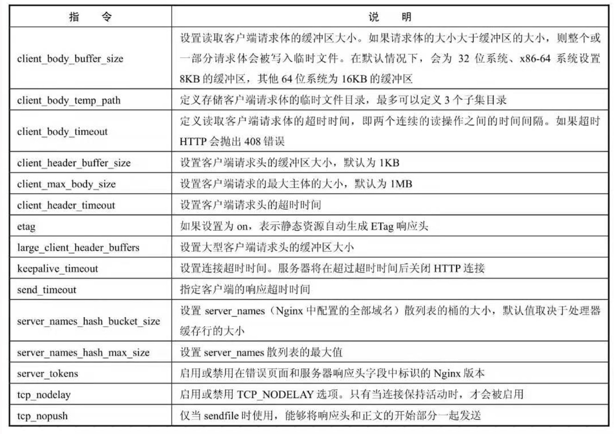

# nginxConf
### 安装nginx
ubuntu 中直接
`
sudo apt-get install nginx
`
进行安装，但是这种安装对定制模块和插件不太友好，所以我推荐用源码安装。以CentOS为栗子：
```
yum -y install wget gcc gcc-c++ autoconf automake make zlib zlib-devel pcre-devel pcre
````
下载源码
```
wget http://nginx.org/download/nginx-1.12.2.tar.gz
```
解压和安装
```
tar -zxvf nginx-1.12.2.tar.gz
cd nginx-1.12.2/
 ./configure
 make && make install
```
自定义初始化需要用到 ./configure 。./configure --help 查看所有参数。

### 基础配置
http块是全局参数，对整体影响，server块是虚拟主机，主要对指定的主机和端口进行配置；location块在虚拟主机下根据请求URI（Uniform Resource Identifier，统一资源标识符）进行配置，URI即去掉参数后的URL
### 与客户端有关的配置

