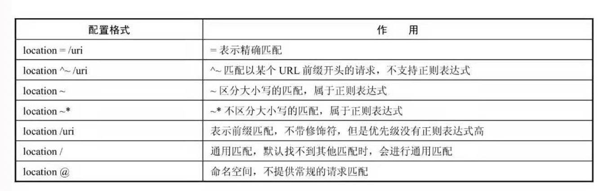

# nginxConf
### 安装nginx
可以直接 中直接
`
sudo apt-get install nginx

`
进行安装，但是这种安装对定制模块和插件不太友好，所以我推荐用源码安装。以CentOS为栗子：
```
yum -y install wget gcc gcc-c++ autoconf automake make zlib zlib-devel pcre-devel pcre
````
下载源码
```
wget http://nginx.org/download/nginx-1.12.2.tar.gz
```
解压和安装
```
tar -zxvf nginx-1.12.2.tar.gz
cd nginx-1.12.2/
 ./configure
 make && make install
```
自定义初始化需要用到 ./configure 。./configure --help 查看所有参数。

### 代理

正向代理：

反向代理：
  
### 基础配置
http块是全局参数，对整体影响，server块是虚拟主机，主要对指定的主机和端口进行配置；location块在虚拟主机下根据请求URI（Uniform Resource Identifier，统一资源标识符）进行配置，URI即去掉参数后的URL




“=”优先级最高，如果“=”匹配不到，会和“^～”进行匹配；继而是“～”，如果有多个“～”，则按照在文件里的先后顺序进行匹配；如果还匹配不到，则与“/uri”进行匹配；通用匹配“/”的优先级最低，如果找不到其他配置，就会进行通用匹配；“@”表示命名空间的位置，通常在重定向时进行匹配，且不会改变URL的原始请求。


###负载均衡

```
upstream backend  {
  server backend1.example.com weight=5;
  server backend2.example.com;
  server unix:/tmp/backend3;
}

```
1.轮询
2.加权轮询
3.ip_hash    每一个请求按ip的hash结果分配，这样来自同一个ip请求固定访问一个后端服务器
4.least_con   最少连接数，哪个机器连接数最少就分配哪个
5.url_hash    通ip_hash  根据url hash结果分配
6.hash关键数值  自定义的key

### gzip
### image_filter_interlace
### webp
### ngx_http_geo_module


### 与客户端有关的配置

